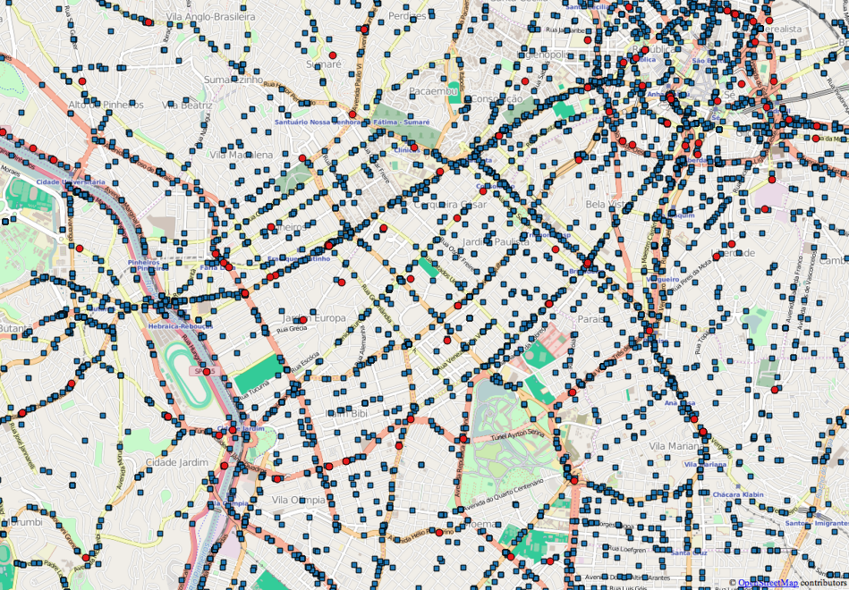

# Ocorrências de trânsito na cidade de São Paulo

[][license]

[license]: https://github.com/codigourbano/ocorrencias-transito-sp/blob/master/LICENSE
[ogr2ogr]: http://www.gdal.org/ogr2ogr.html
[mdbtools]: http://mdbtools.sourceforge.net/
[mapinfo]: https://en.wikipedia.org/wiki/MapInfo_Professional
[qgis]: http://www.qgis.org
[shapefile]: https://en.wikipedia.org/wiki/Shapefile
[pmsp]: http://www.capital.sp.gov.br
[cet]: http://www.cetsp.com.br

Em fevereiro de 2016, um [pedido de informação do Código Urbano](http://codigourbano.org/lai-garante-acesso-a-dados-sobre-mortos-e-feridos-no-transito-de-sp) fez com que a [Prefeitura de São Paulo][pmsp] publicasse pela primeira vez dados brutos sobre colisões e atropelamentos na cidades de São Paulo.

Este repositório organiza em formato aberto os dados deste e outros pedidos de informação sobre este tema.

## Baixar dados

* [2011](dados/2011)
* [2012](dados/2012)
* [2013](dados/2013)
* [2014](dados/2014)
* [2015](dados/2015)
* [Histórico completo](https://github.com/codigourbano/ocorrencias-transito-pmsp/raw/master/dados/ocorrencias-transito-pmsp-2011-2015.zip)

Outras informações:

* [Dicionário](DICIONARIO.md)
* [Dados originais](dados-originais)

## Histórico

* Out/2016: [Deferimento do 2o. pedido](http://codigourbano.org/dados-abertos-sobre-mortos-e-feridos-no-transito-de-sp-de-2011-a-2015), com série histórica de 2011 a 2015;
* Fev/2016: [Deferimento do 1o. pedido](http://codigourbano.org/lai-garante-acesso-a-dados-sobre-mortos-e-feridos-no-transito-de-sp/) (dados de 2014);

## Licença

Todo o conteúdo deste repositório está sob a [licença de domínio público CC0](http://creativecommons.org/publicdomain/zero/1.0/deed.pt).
